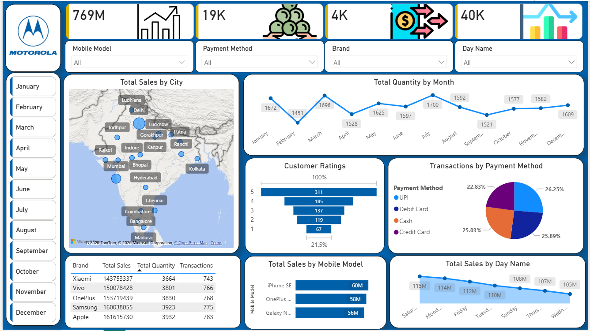

# 📊 Mobile Sales Dashboard – Power BI
## 📌 Project Overview

This project presents an interactive Mobile Sales Dashboard built using Power BI. The dashboard analyzes mobile phone sales data across different cities and provides insights into sales performance, customer ratings, transactions, and payment methods.

The dashboard helps visualize key business metrics and allows users to explore the data using interactive filters.

## 🎯 Key Metrics

- Total Sales: 769M

- Total Quantity Sold: 19K

- Total Transactions: 4K

- Total Customers: 40K

## 📊 Dashboard Features

The dashboard includes several interactive visualizations:

- Total Sales by City – Map visualization showing sales distribution across Indian cities.

- Monthly Quantity Trend – Line chart displaying total quantity sold by month.

- Customer Ratings – Distribution of customer ratings from 1 to 5.

- Transactions by Payment Method – Breakdown of payments using UPI, Debit Card, Credit Card, and Cash.

- Total Sales by Mobile Model – Comparison of top-selling mobile models.

- Sales by Day Name – Sales trends across different days of the week.

- Brand Performance Table – Sales, quantity, and transaction comparison across brands.

## 🎛 Filters Available

Users can interact with the dashboard using the following filters:

- Mobile Model

- Payment Method

- Brand

- Day Name

- Month

These filters help analyze the data dynamically.

## 🛠 Tools Used

- Power BI Desktop

- Microsoft Excel (Dataset)

- Data Visualization

- DAX Measures

📷 Dashboard Preview

